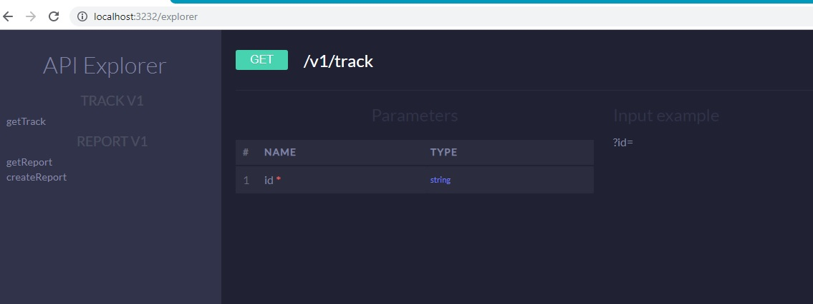
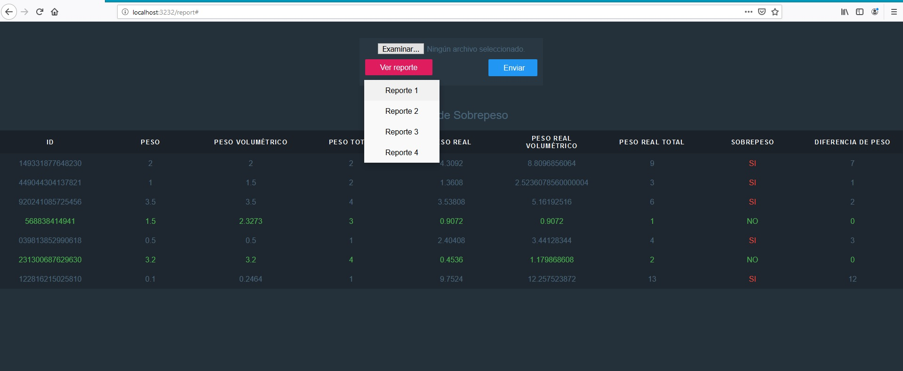

Guía de Instalación
====

**Requerimientos**
- Node >= v8.0.0
- npm  >=  v5.0.0
- pm2  >=  2.6.1

Ir a la carpeta del proyecto para instalar las librerias
```sh
$ npm install
```

Instalar pm2 en modo global 
```sh
$ npm install pm2 -g
```

# Ejecutar la aplicación
```js
pm2 start ecosystem.example.yml --env development	

logs

pm2 logs api-koa

restart

pm2 restart api-koa
```

**Rutas**

[http://localhost:3232/explorer](http://localhost:3232/explorer) Explorador de endpoints.


[http://localhost:3232/report](http://localhost:3232/report) Vista para el reporte de sobrepeso.


[http://localhost:3232/v1/track?id=149331877648230](http://localhost:3232/v1/track?id=149331877648230) Track by ID.


Con Docker
=============================

**Requerimientos**
- Docker
- Docker-compose

**Ir a la carpeta del proyecto y construir las imagenes de docker**

```sh
$ docker-compose build
```

**Configurar el archivo docker-compose con las variables que se usaran:**
```sh
$ docker-compose up -d
```

Reporte de sobrepeso
=======

```
ID: 568838414941

Peso:  1.5                               (Del Json)
Peso volumétrico: 2.3273   (calculado en base al Json y luego toma el mayor)
Peso total:  3                         ( Redondea el peso volumétrico)

Peso real:  0.9072            (De la api Fedex)
Peso real volumétrico: 0.9072 (calculado en base a la api y luego toma el mayor)
Peso real total:  1              ( Redondea el peso volumétrico)

Sobrepeso: No (Si el "Peso total" es menor a "Peso real total" entonces es "Sobrepeso")

En caso de que Sobrepeso sea SI

Diferencia de sobrepeso: ("Peso real total" -  "Peso total") 
```


